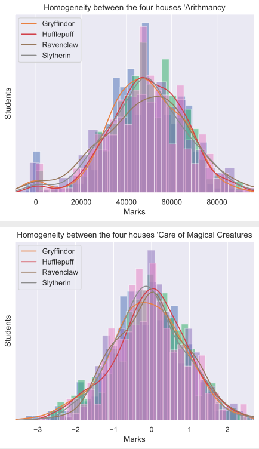
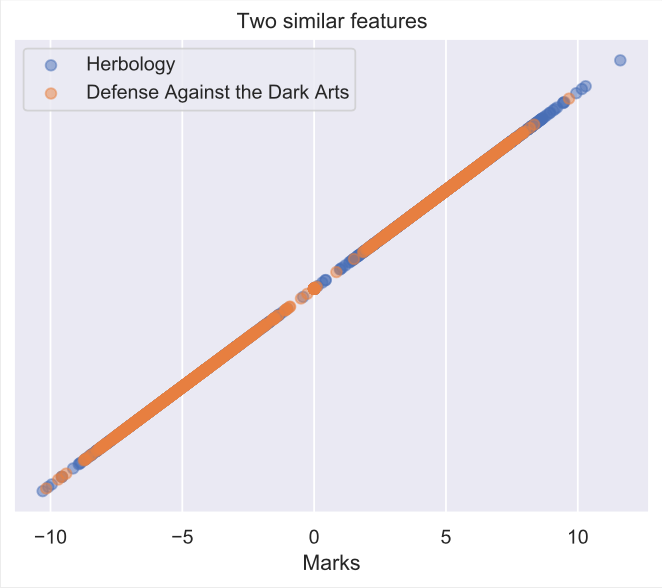
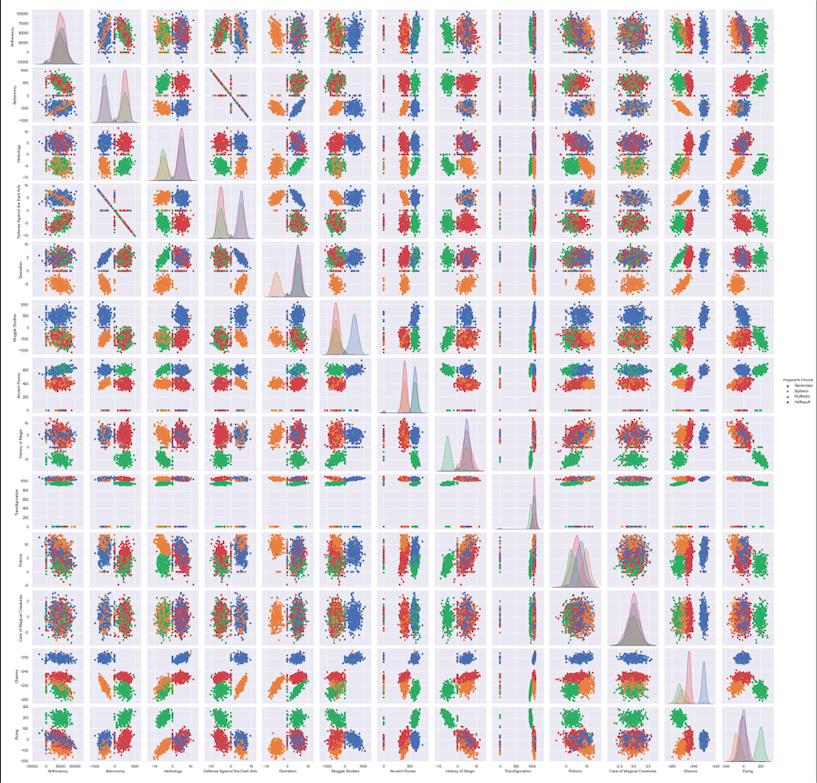
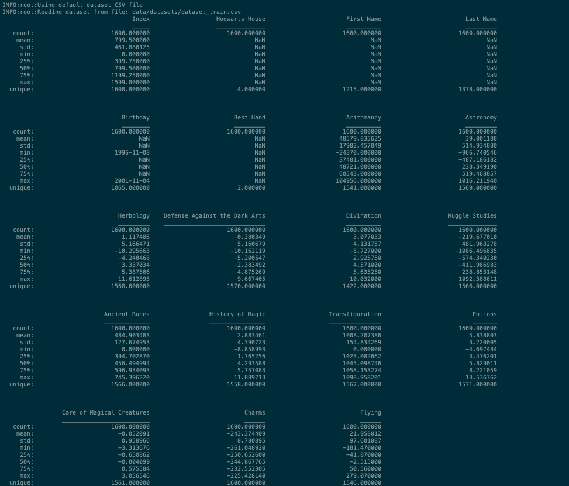

# DSLR

DataScience Logistic Regression - Xamartin and Lotoussa
[subject.pdf](subject/DatascienceLogisticRegression.fr.pdf)

## Setup:

```
pip3 install -r requirements/requirements.txt
python3 sources/main.py -h
```

## Data analysis

To follow the subject and generate specific graphic:
   - An histogram: `python3 sources/histogram.py`


   
   - An scatter plot: `python3 sources/scatter_plot.py`


   
   - An pair plot: `python3 sources/pair_plot.py`


   
   - An describer: `python3 sources/describe.py`


   

## Logistic regression

The main part:
   - The logistic regression trainer file `logreg_train.py`, that will generate a file with the predicition from the gradient descent
   For batch gradient descent:

         python3 logreg_train.py -c "Hogwarts House" -bgd
      For stochastic gradient descent:

         python3 logreg_train.py -c "Hogwarts House" -sgd
   - The predict program `logreg_predict.py` that take the file generate previously and predict every house form the dataset given

         python3 logreg_train.py -c "Hogwarts House" -f data/datasets/dataset_test.csv

   - Test it with `school_scorer.py`, it uses `houses.csv`, generated by `logreg_predict.py` and compared it with `dataset_truth.csv`. It generate a percentile of similarity between the two files.
   - Test it also with `test.py`, it uses `dataset_train.csv` and test it 10 times with randomly separated dataset. Show times and accuracy.

         python3 sources/test.py -c "Hogwarts House" -bgd/sgd

## Resources

All Resources are found in data or subject
